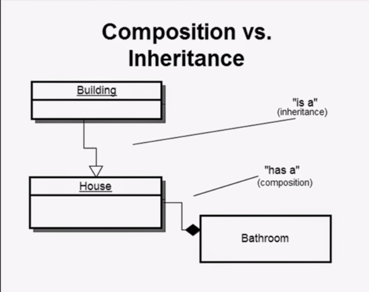

# 🏢 Composition over inheritance

The purpose of this repository is exploring the composition capabilities in TS and how it can be used to solve architectural problems that might be problematic using an approach based on inheritance.

  

